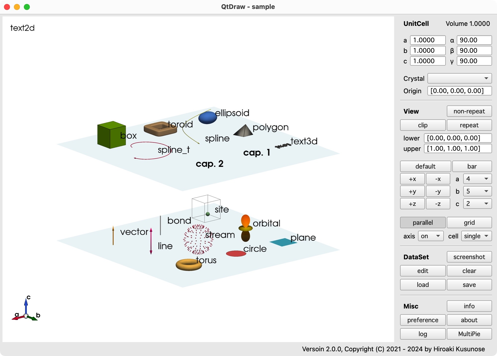
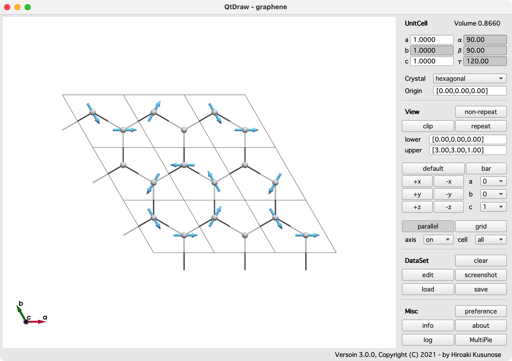
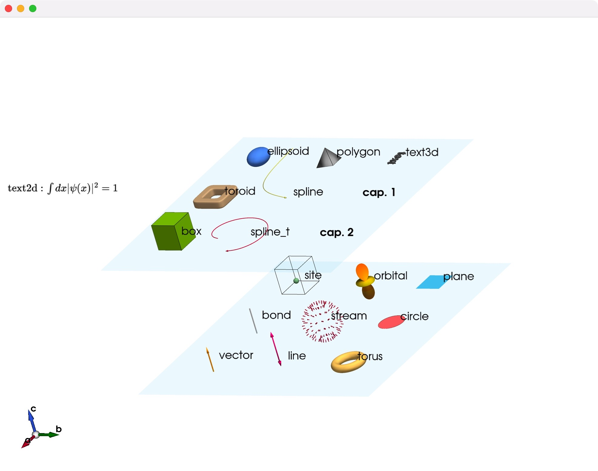
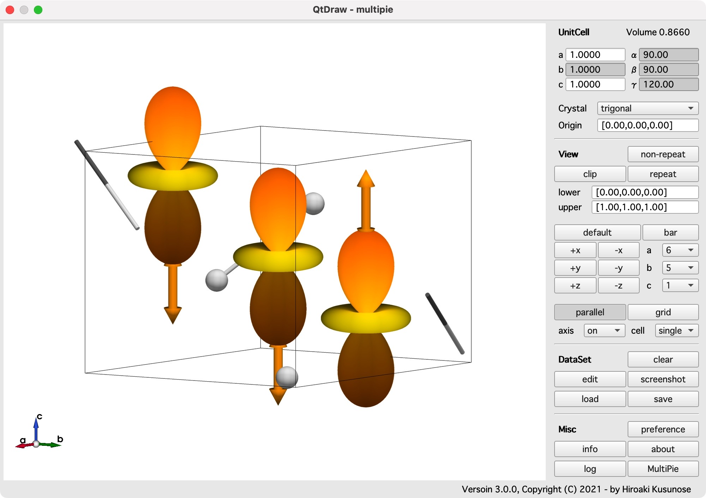
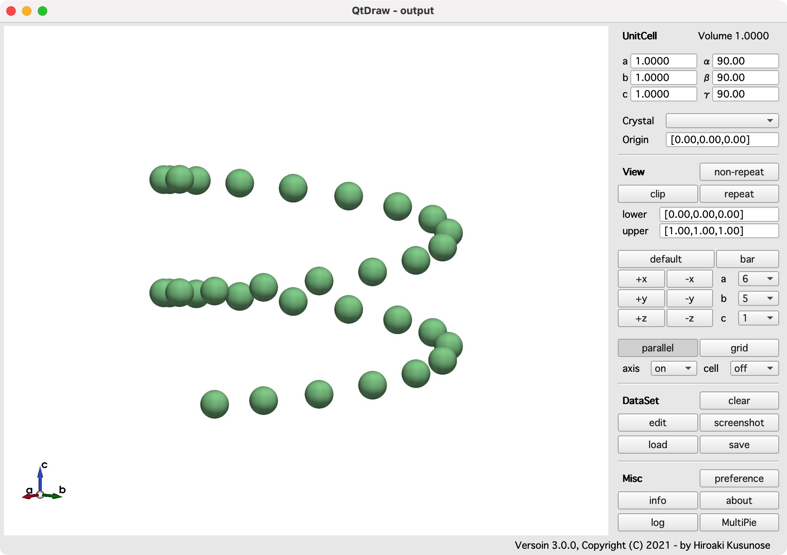
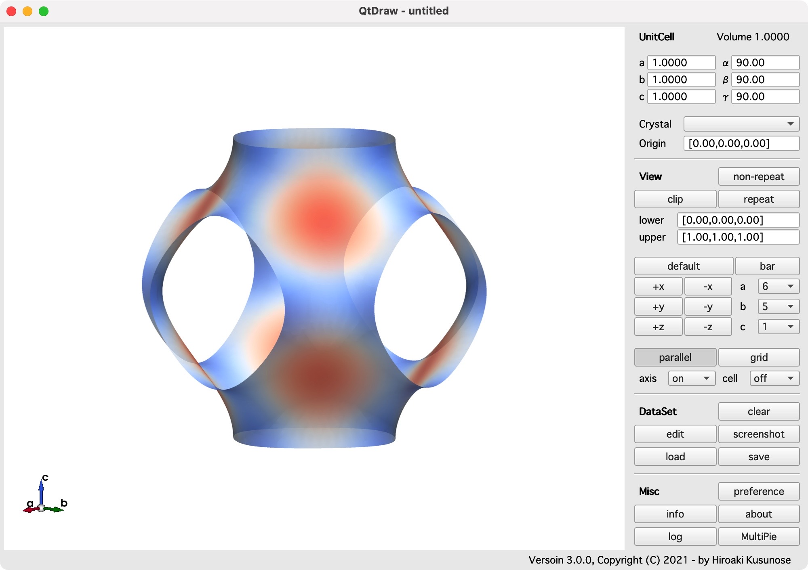

# Examples

The examples for **QtDraw**.

## load from files

```{literalinclude} examples/load.py
```

## from Jupyter Notebook

- [QtDraw](examples/qtdraw.ipynb)
  
- [Graphene with MultiPie](examples/mp_graphene.ipynb)
  
- [Te with MultiPie](examples/mp_Te.ipynb)
  
- [PyVistaWidget](examples/pyvista_widget.ipynb)
  
- [with MultiPie](examples/multipie.ipynb)
  

## background plot

```{literalinclude} examples/background.py
```



## isosurface plot

```{literalinclude} examples/isosurface.py
```


