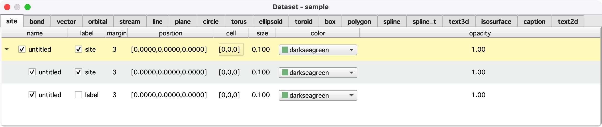
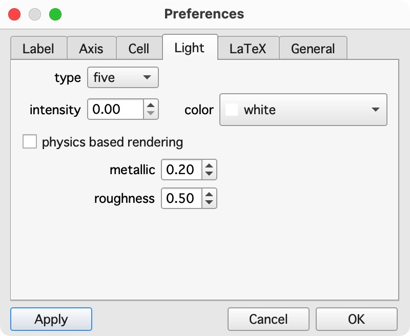

# Getting Started

## Main window

The main window of **QtDraw** is the following, which has the main and control panels.


## Create and Edit Object

To draw these objects, push `e` key or `edit` button in the right panel, and then the `Dataset` window appears as follows.



In the `Dataset` window, you can choose the object in the tab, and in each tab, you can create or copy an object in the context menu by right-clicking. The easiest way to create an object, you first create an object with the default value, and then you can edit it freely.

By right-clicking at the object in the main panel, the context menu shows up, and you can remove, hide, or open the corresponding object.


## Preference

Look and feel of **QtDraw** can be modified by using `preference` panel as follows.



## Create Object from Python Code

All the objects can also be drawn from Python code or Jupyter Notebook.
The example of Jupyter Notebook is given in [qtdraw.ipynb](examples/qtdraw.ipynb).
See [API](from_python.md) in detail.
Using this functionality, the background job can be performed.
See the example in
```{literalinclude} examples/background.py
```
The same thing is also simply done by
```{literalinclude} examples/background_s.py
```

For more examples, see [example page](example.md)
