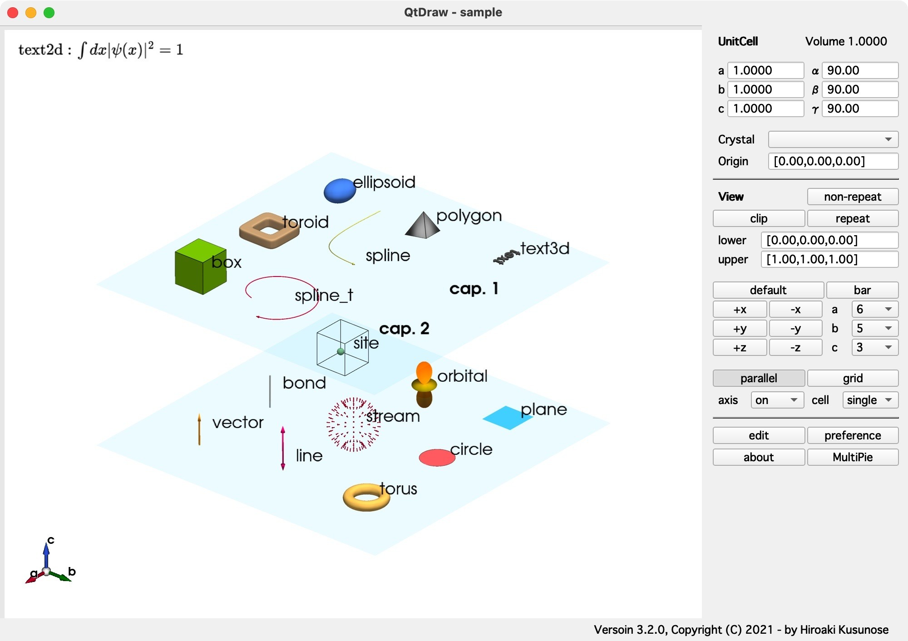
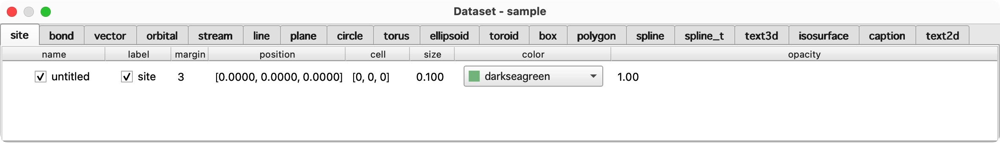
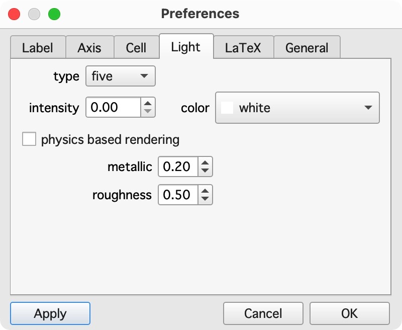

# Getting Started

## Main window

The main window of **QtDraw** is the following, which has the main and control panels.



## Create and Edit Object

To draw these objects, push `e` key or `edit` button in the right panel, and then the `Dataset` window appears as follows.



In the `Dataset` window, you can choose the object in the tab, and in each tab, you can create or copy an object in the context menu by right-clicking. The easiest way to create an object, you first create an object with the default value, and then you can edit it freely.

By right-clicking at the object in the main panel, the context menu shows up, and you can remove, hide, or open the corresponding object.

## Mouse and Keys

The same summary is shown by `Help` > `Mouse and Keys` in the menu bar.

In the main panel:
- Left drag: rotate. Shift + left drag: move. Wheel or right drag: zoom.
- Right click (without dragging) on an object: context menu to open it in the `Dataset` window, hide or remove it.
- `e`: open the `Dataset` window.

In the `Dataset` window:
- Right click: context menu to create or copy an object.
- `Esc`: clear the selection. `Up`, `Down`: move the selection.

The `File` menu opens (Ctrl+O, Cmd+O on macOS), reopens one of the last 10 files (`Open Recent`), saves (Ctrl+S, Cmd+S), saves under another name (`Save As`, Ctrl+Shift+S, Cmd+Shift+S), saves a screenshot, clears all objects and quits (Ctrl+Q, Cmd+Q). `Save` writes to the file opened or saved last, and asks for a name the first time or after importing a CIF, VESTA or XSF file. When the window is closed with unsaved changes, QtDraw asks whether to save them; without changes it closes at once.

The `Edit` menu undoes (Ctrl+Z, Cmd+Z on macOS) and redoes (Ctrl+Y or Ctrl+Shift+Z depending on the platform, Cmd+Shift+Z on macOS) changes of objects, unit cell, range and MultiPie group. The camera, view settings and preferences are not changed by undo or redo. Opening a file starts a new history; saving keeps it. `DataSet` opens the table of all objects (as the `e` key), and `Preferences` the preferences (in the application menu on macOS).

The `View` menu sets the view direction (Ctrl+1 to Ctrl+6 for +x, +y, +z, -x, -y, -z, Ctrl+0 for the default; Cmd on macOS) and switches parallel projection, grid, scalar bar, clip, repeat, axis and cell, as the panel does.

The `Window` menu shows the messages of QtDraw (`Info`) and the log (`Log`), and the internal data for checking a drawing: the camera, the raw data of all objects, the actor names, the status and the preferences (`Camera`, `Data`, `Actor`, `Status`, `Preference`).

The `Help` menu shows the mouse and key operations, opens this documentation and the page to report an issue, and shows the version information.

The buttons below the unit cell and view settings open the `Dataset` window (`edit`) and the MultiPie dialog. The preferences are in `Edit` > `Preferences`, and the version information in `Help` > `About QtDraw` (both in the application menu on macOS).

If an error occurs, a short message is shown; the traceback is behind `Show Details...` and also in the log. Please include it when you report a problem.


## Preference

Look and feel of **QtDraw** can be modified by using `preference` panel as follows.



## Create Object from Python Code

All the objects can also be drawn from Python code or Jupyter Notebook.
The example of Jupyter Notebook is given in [qtdraw.ipynb](examples/qtdraw.ipynb).
See [API](from_python.md) in detail.
Using this functionality, the background job can be performed.
See the example in
```{literalinclude} examples/background.py
```
The same thing is also simply done by
```{literalinclude} examples/background_s.py
```

For more examples, see [example page](example.md)
