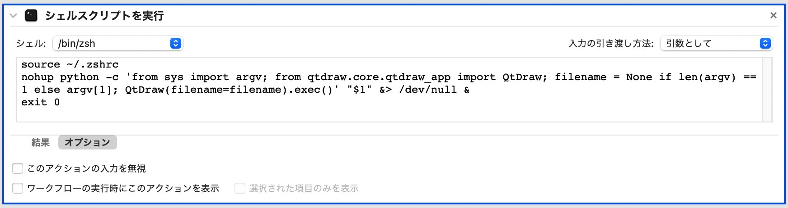

# Installing QtDraw

**QtDraw** can be installed from PyPI using pip on Python 3.11 or later.

## Requirements

- Python ≥ 3.11
- [Optional] A [MultiPie](https://github.com/CMT-MU/MultiPie) is recommended for using crystallographic symmetry operations.

## Installation

1. Set up a Python environment

- **macOS**

  - Install [Homebrew](https://brew.sh) (if not already installed):
  - Install Python:

    ```bash
    brew install python@3.13
    ```

  - Add Python (and LaTeX, if needed) to your `.bashrc` or `.zshrc`:

    ```bash
    export PATH=/opt/homebrew/opt/python@3.13/libexec/bin:$PATH
    ```

  - If you use a virtual environment (e.g. `~/.venv`), prepend its bin directory to PATH.
  - Restart your shell.

- **Linux**

  - Install Python using your distribution’s package manager or from source.
  - Add Python (and LaTeX, if needed) to your shell configuration file (e.g. `.bashrc` or `.zshrc`):

    ```bash
    export PATH=/path/to/python/bin:$PATH
    ```

  - If you use a virtual environment, ensure its bin directory appears before the global Python path.
  - Restart your shell.

- **Windows**

  - Install PowerShell and Python by following the instructions at:
<https://microsoft.com/PowerShell>
  - Ensure that Python is added to your system PATH during installation.

2. Install QtDraw

    All required dependencies will be installed automatically. In order to use MathJax rendering for LaTeX, install playwright browser such as chromium.

    ```bash
    pip install qtdraw
    playwright install chromium
    ```

3. Install MultiPie

    Install the symmetry operation tool MultiPie:

    ```bash
    pip install multipie
    ```

- **Linux** (Ubuntu 22.04.4 LTS on WSL2)
   - Add the following line to your `.bashrc`:

      ```bash
      export QT_QPA_PLATFORM=xcb
      ```

   - Install required system libraries:

      ```bash
      sudo apt update
      sudo apt upgrade  # optional, but recommended
      sudo apt install libxcb-cursor0
      ```

4. Associate QtDraw file (**.qtdw**) to the application

    It is useful to associate with the following application with `.qtdw`, `.cif`, `.vesta`, and `.xsf` extensions.

- **MacOS**
  - Download and extract [QtDraw_MacApp.zip](https://github.com/CMT-MU/QtDraw/tree/main/others/QtDraw_MacApp.zip), and move it into Applications folder
  - Associate extensions with `QtDraw.app`
  - (Note) `QtDraw.app` is created by Automator with the following script:

    ```bash
    source ~/.zshrc
    if [ -z "$1" ]; then
        nohup qtdraw &> /dev/null &
    else
        nohup qtdraw "$1" &> /dev/null &
    ```

    

- **Windows**
  - Associate extensions with `qtdraw.exe` in `Scripts` folder or [QtDraw_WinApp.zip](https://github.com/CMT-MU/QtDraw/tree/main/others/QtDraw_WinApp.zip)
  - `Scripts` is found usually under `C:\Users\<username>\AppData\Local\Programs\Python\Python<version>\`

## Shell Commands

QtDraw provides the following command-line utilities:

- `qtdraw [filename]` : Open QtDraw file.
- `conv_qtdraw3 [ver1_file.qtdw]` : Convert Version 1 `.qtdw` file into this version (Version 3).

See the [Getting Started](getting_started.md) guide for examples.

## Source Code

- PyPI: <https://pypi.org/project/qtdraw/>
- GitHub: <https://github.com/CMT-MU/QtDraw>
