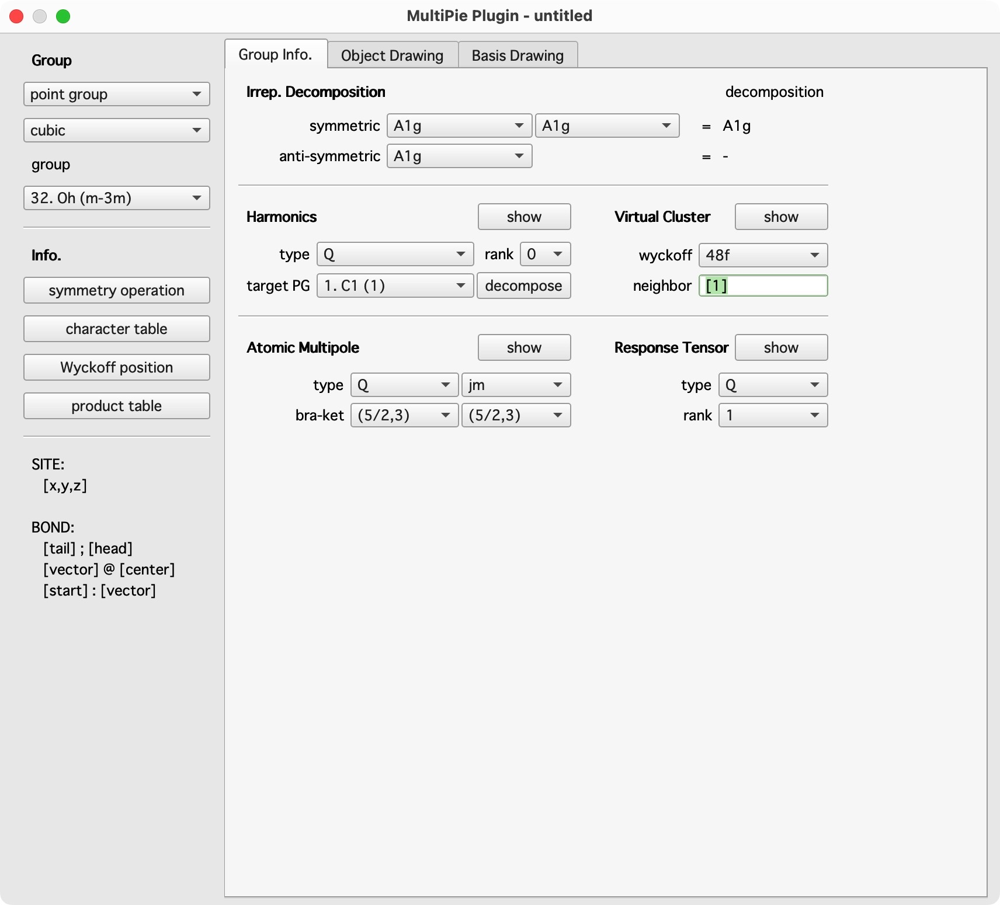

# Overview

**QtDraw** is 3D drawing tool for molecules and crystals based on [PyVista](https://docs.pyvista.org/) and [PySide6](https://doc.qt.io/qtforpython-6/index.html).
The main window and available objects looks like the following.

All objects can be modified by GUI in the Dataset window.

All objectes are located at the `position` + `cell` in the fractional coordinate of the `crystal` system with the `origin`, which allows us to repeat the drawn objects just by pushing `repeat` button.
By `non-repeat` button, the repeated objects can be converted to those at the same `position` with the home cell, i.e., `cell=[0,0,0]`.

By installing the Pyhton package, [MultiPie](https://github.com/CMT-MU/MultiPie), which provides the various crystallographic symmetry operations and symmetry-adapted basis construction, object drawing in **QtDraw** is also associated by the symmetry operation and symmetry-adapted basis. To use this functionality, push `MultiPie` button in the bottom right.
The additional window for `MultiPie` plug-in is shown below.

